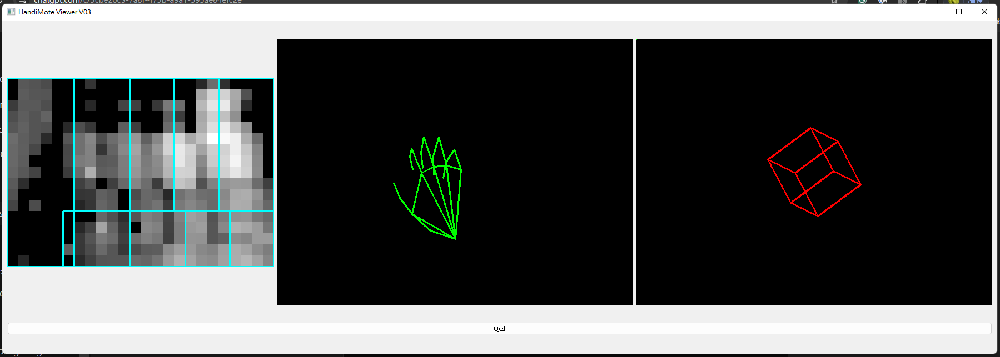

# HandiMote Viewer V03

HandiMote Data Collector is an application for collecting and displaying gesture and motion data. It can retrieve gesture data from a BLE device, process it using a TensorFlow Lite model, and display it in the application interface. Additionally, it displays a motion cube and motion path based on motion data.



## Table of Contents

- [Features](#features)
- [Installation](#installation)
- [Usage](#usage)
- [File Structure](#file-structure)


## Features

- Collect grayscale images and 6DOF motion data from a BLE device
- Process gesture data using a TensorFlow Lite model and display it in the interface
- Display a motion cube that rotates based on motion data
- Display a motion path that periodically clears to prevent clutter

## Installation

1. Clone this repository to your local machine:
    ```bash
    git clone https://github.com/yourusername/handimote-data-collector.git
    cd handimote-data-collector
    ```

2. Create and activate a virtual environment (recommended):
    ```bash
    python -m venv venv
    source venv/bin/activate  # On Windows, use `venv\Scripts\activate`
    ```

3. Install the required Python packages:
    ```bash
    pip install -r requirements.txt
    ```

4. Install necessary system dependencies (e.g., OpenCV and PyQt5):
    ```bash
    pip install opencv-python-headless PyQt5
    ```

## Usage

1. Start the application:
    ```bash
    python HandiMote_LandmarkConsole.py
    ```

2. When the application starts, select the trained TensorFlow Lite model file (with `.tflite` extension).

3. The application will automatically connect to the specified BLE device and start receiving data and displaying it on the interface.

## File Structure

```plaintext
handimote-data-collector/
├── HandiMote_LandmarkConsole.py      # Main application
├── utilities.py                      # Utility functions for handling BLE data
├── ble_device.py                     # BLE device connection and data handling
├── motion_processor.py               # Motion data processing
├── config.py                         # Configuration file, including UUIDs
├── requirements.txt                  # List of required Python packages
├── README.md                         # Application instructions
└── add.h                             # File containing device address
