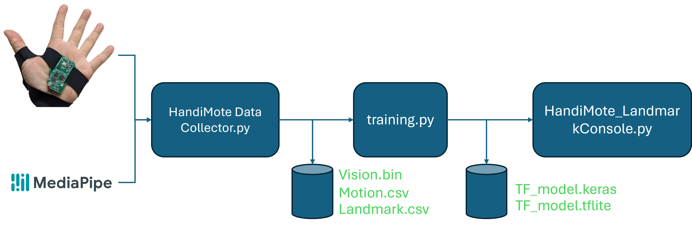

## HandiMote Hand's Landmark Training Flow




# HandiMote Data Collector

This is a data collection and synchronization tool for HandiMote landmark training using Mediapipe. It collects and stores motion data, vision data, and hand landmarks from Mediapipe. Ensure your Python-running PC has camera module support.


## Features

- Connects to the specified BLE device
- Real-time display of hand landmarks and connections
- Stores hand landmark, motion, and vision data

## Requirements

- Python 3.6 or higher
- Mediapipe
- OpenCV
- PyQt5
- asyncio
- numpy
- Camera module support on the PC

## Installation

Ensure you have installed all required Python packages:

```sh
pip install mediapipe opencv-python PyQt5 numpy asyncio
```

## Usage

1, Configure Device Address

In the add.h file, input your BLE device address. For example:
```c
#define DEVICE_ADDRESS "XX:XX:XX:XX:XX:XX"
```
2, Run the Program

Run the program using the following command:
```sh
python HandimoteTrainDataCollection.py
```

3, Operation Instructions

* Upon starting the program, you will be prompted to enter a batch name. You can input any name to identify this data collection session.
* Enter the distance from the wrist to the thumb MCP (in cm), with a default value of 6 cm.
* The program will attempt to connect to the configured BLE device.
* Once connected, it will start displaying hand landmarks and connections.
* Click the Capture Data button to save the current hand landmarks and motion data.

4, Data Storage

Data will be stored in a folder named after the batch name, with the following structure:
```php
├── <batch_name>
    ├── vision
    │   └── vision_data_<timestamp>_<batch_name>.bin
    ├── motion
    │   └── motion_data_<timestamp>_<batch_name>.csv
    └── landmark
        └── landmark_data_<timestamp>_<batch_name>.csv
```

## Parameter Adjustment

* min_detection_confidence: Adjusts the confidence threshold for hand landmark detection (0.0 to 1.0), default is 0.7.
* min_tracking_confidence: Adjusts the confidence threshold for hand landmark tracking (0.0 to 1.0), default is 0.5.
You can adjust these parameters during the Hands model initialization to improve tracking stability and accuracy:
```py
hands = mp_hands.Hands(
    static_image_mode=False,
    max_num_hands=1,
    min_detection_confidence=0.7,
    min_tracking_confidence=0.5
)
```

## Notes
Ensure your camera is working properly and there is sufficient lighting to improve the accuracy of hand landmark detection.
If the program cannot connect to the BLE device, verify that the device address is correct and that the BLE device is discoverable.


