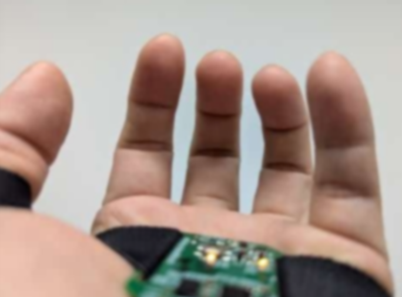
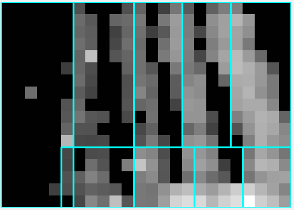

# Introduction to Using the Vision Data Matrix

Our vision data matrix is 24x20 pixels in size, with each pixel represented by 8 bits (1 byte). This matrix includes data for the user's five fingers in a fixed position relative to the user's palm. Note that only a 24x17 area of the matrix is active; the first 3 rows should be skipped during data analysis. Below is an explanation of how to interpret and use this data.

## Vision Data Matrix Structure

1. **Matrix Size**: 24 rows x 20 columns, with each element being 8 bits (1 byte).
2. **Active Area**: Skip the first 3 rows. Only the rows from 4 to 20 are active.
3. **Data Representation**: Each element represents a grayscale value of a pixel, ranging from 0 to 255, where 0 indicates black and 255 indicates white.

## Why Place the Sensor on the User's Palm?

Placing the sensor on the user's palm offers several advantages:

- **Direct Sensing of Fingers**: When the sensor is placed at the bottom of the palm, it can directly sense the user's fingers very clearly.
- **Consistent Relative Position**: No matter how fast the user moves their hand or what the rotation angle is, the sensor and fingers remain in the same relative position. This ensures a clear and consistent sensing environment.
- **Ideal Sensing Condition**: This setup provides an ideal condition for sensing as the fingers' positions and movements are accurately captured relative to the sensor.

## Finger Positioning

This matrix contains the data for the user's five fingers, which are distributed in fixed positions within the matrix. The diagrams below show examples of the finger positions within the matrix:

  
  

## Usage Steps

1. **Read Matrix Data**: Read the 24x20 data matrix from the device or file.
2. **Parse Data**: Parse each 8-bit data element into a grayscale value.
3. **Identify Active Area**: Skip the first 3 rows and focus on the remaining rows (4 to 20).
4. **Identify Finger Positions**: Identify the distribution of grayscale values for each finger based on their fixed positions in the matrix.
5. **Data Application**: Perform corresponding image processing or gesture recognition operations based on the grayscale values.

